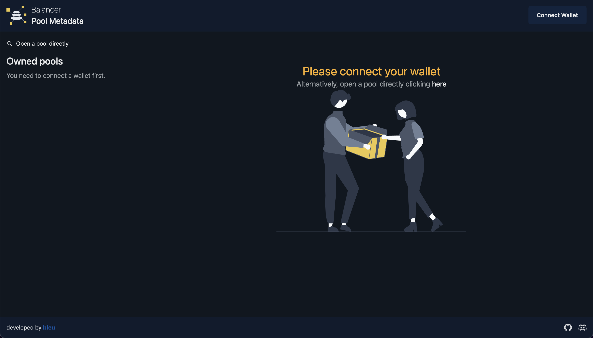
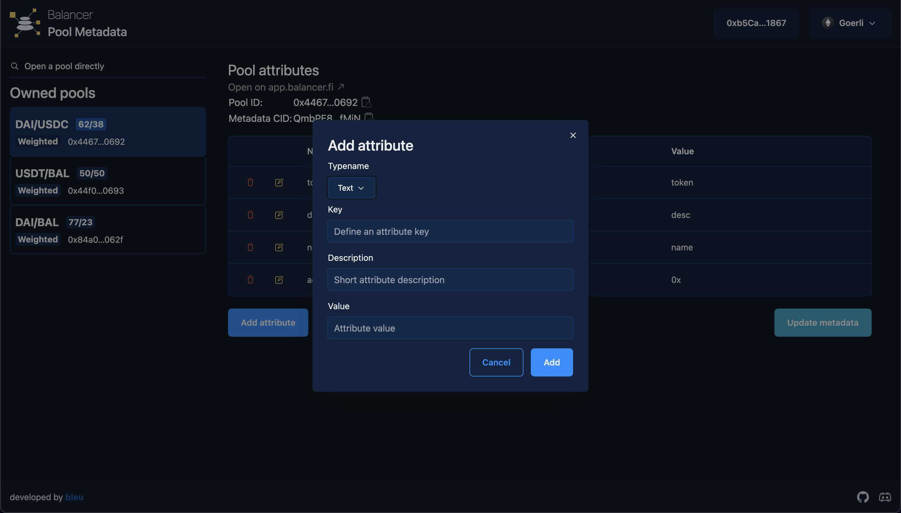
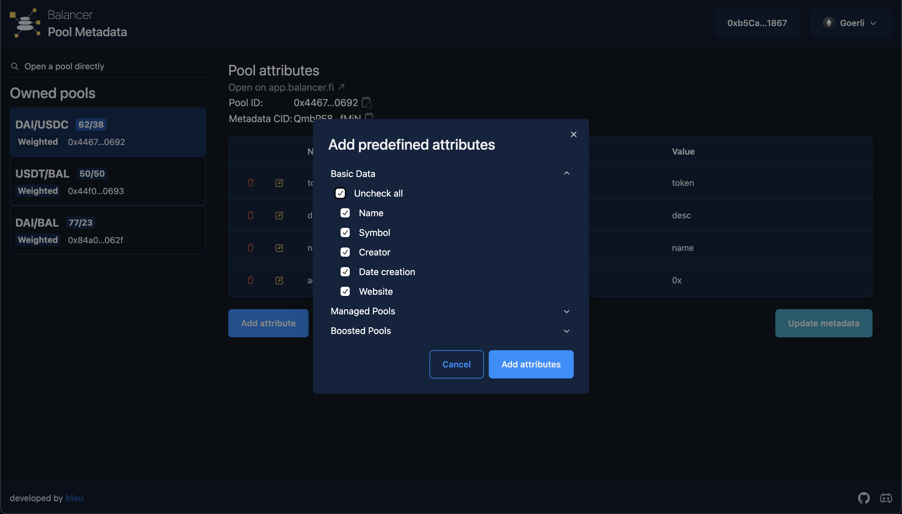
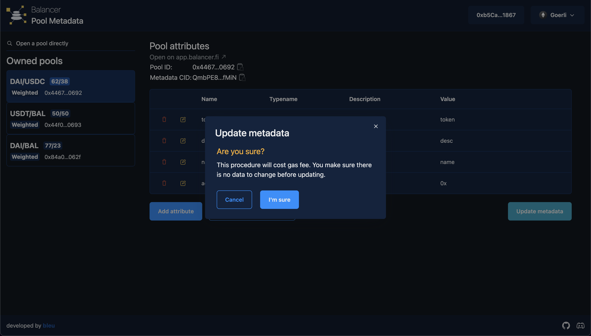
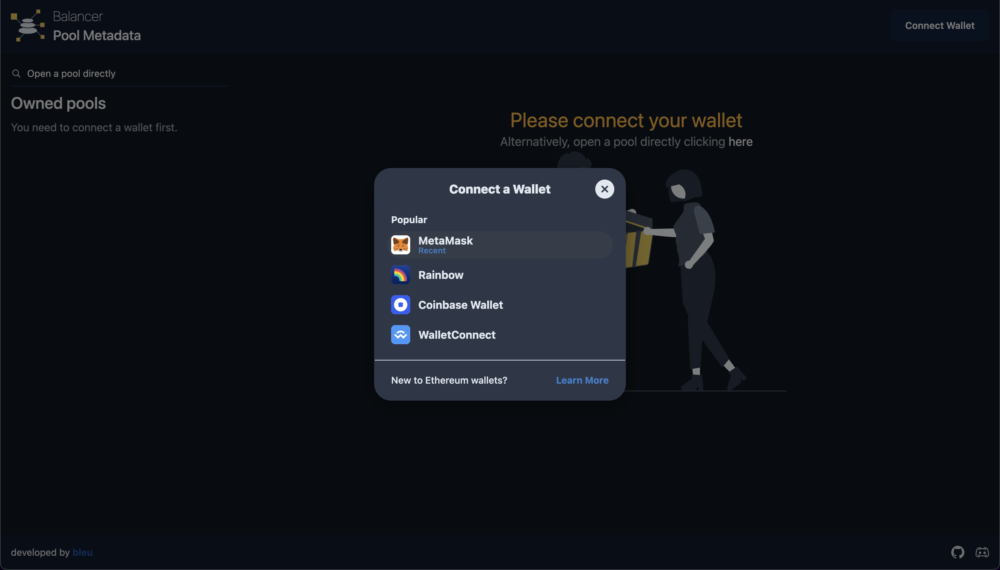
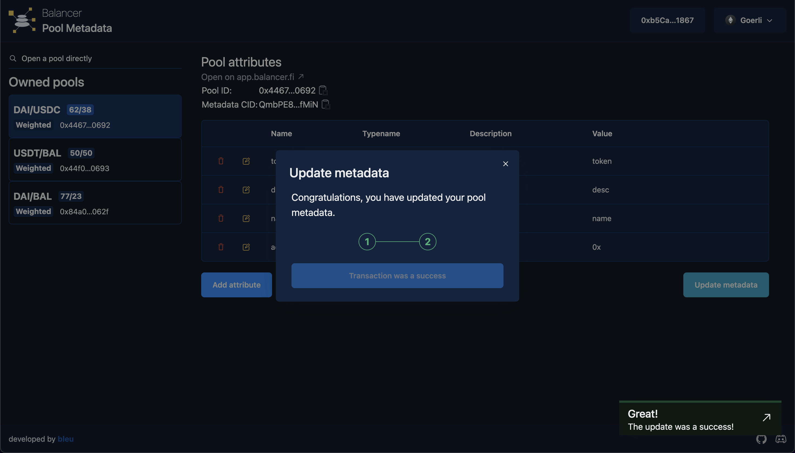
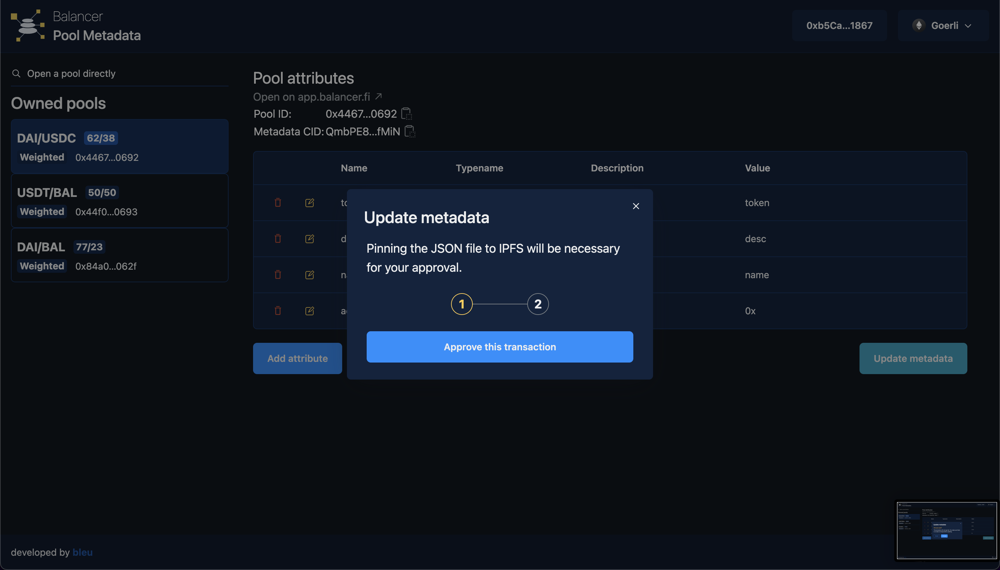
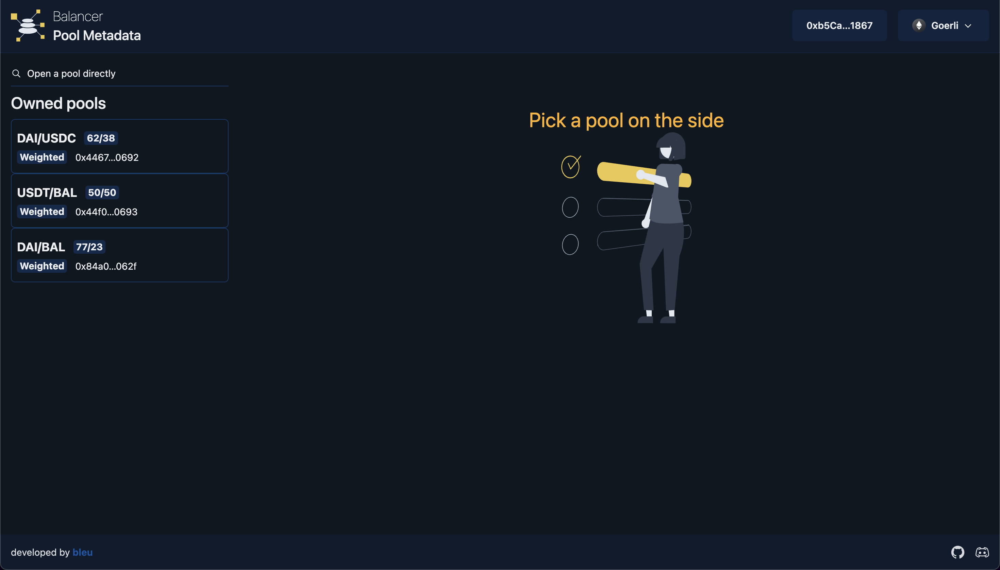
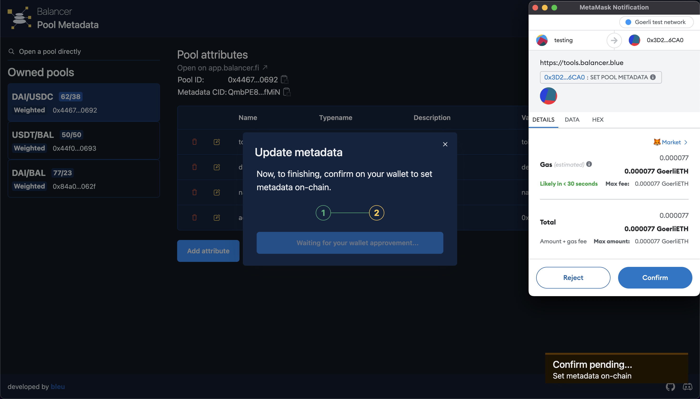

### Pool Metadata
Pool Metadata is an open source tool designed to provide additional insights into pool types and compositions on Balancer. It aims to serve as a comprehensive and convenient way for pool owners to add metadata such as name, symbol, description, links, logos, and more to their pools. This tool is not exclusive to Balancer's front-end; any team building on Balancer (e.g., Fjord, Xave, Copper, etc) can consume the data and display it on their own UIs.

# Table of Contents
- [Table of Contents](#table-of-contents)
  - [Features](#features)
  - [How To Use](#how-to-use)

## Features
  - Pool Metadata: Provides an interface for pool owners to add descriptive metadata to their pools.
  - Flexible Data Fields: Allows for different data fields to cater to unique use cases.
  - Improved UI: Facilitates better understanding of each pool type and their key differences.
  - Cross Compatibility: Can be used by any team building on Balancer to display data on their own UIs with Metadata Subgraph.

## How To Use
If you are a Pool Owner, follow the steps below to utilize its features:

Connecting: Begin by connecting your wallet and selecting the network.

Pool Selection: Once connected, navigate to the pool you wish to update or visualize the metadata. You can search for your pool using the search bar at the top-left of the page.

Update Metadata: On the pool page, click on the 'Update Metadata' button. Here you can add or edit your pool's metadata like name, symbol, description, links, etc. 

You can also add predefined attributes to your pool. These attributes are pre-filled and you will need to add the values for them. For example, if you want to add a `website` attribute, you can select it from the dropdown and add the website URL in the value field.

Save Changes: After making the desired changes, make sure to click on the 'update metadata' button to finalize the updates. The updated metadata will be visible immediately on your pool page.

If you encounter any problems or have any suggestions, please file an issue on the GitHub page for this project.

We hope you find Pool Metadata useful and we look forward to seeing the ways in which it helps you enhance your Balancer pools.

